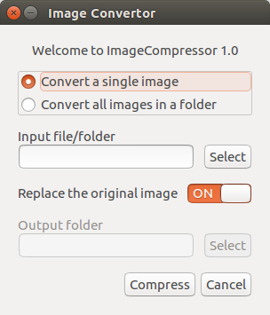

# ImageCompressor

Optimize your images with a perfect balance in quality and file size.

ImageCompressor uses TinyPng's developer API to compress images without losing any quality.Works with windows, mac and gtk based desktops on Linux.


How the GUI looks
=================





A Small Example
===============

Before compression : Size- 4.5 Mb


After compression : Size- 1.3 Mb


Hurray !!!! 

A lot of compression in size but negligible loss in quality.


Getting Started
===============

For Linux or Mac follow these steps:

To install pip run the following command..
```
sudo apt-get install -y python3-pip
```
To install tinify package run this command.
```
pip3 install tinify
```
For windows follow the steps in this link:

http://arunrocks.com/guide-to-install-python-or-pip-on-windows/


>Note: there is no sudo for windows as well as when you have root privelages. 
Just run commands without sudo

>Note: some setups use python instead of python3 and pip3 instead of pip


How to use
==========

Register at: https://tinypng.com/developers 
Copy the api key and paste it in apikey.txt
Then open terminal in that directory and run the comand
```
python3 main.py
```

Contact Us
==========

https://gitter.im/ImageCompressor/Lobby

HOW TO CONTRIBUTE
=================

'ImageCompressor' is in its very early development stage, you can go over the issues on the github issues page and send in a PR.

Your commits in the PR should be of the form:

```
shortlog: commit message

commit body
Fixes <issue number>
```

Where short log is the area/filename where you make the change.
Commit message is the very brief description of the change made by you and any.
Other additional details go into the commit body.

Do remember to keep your master branch updated at all times
and always work on a different branch.

Happy coding :)
